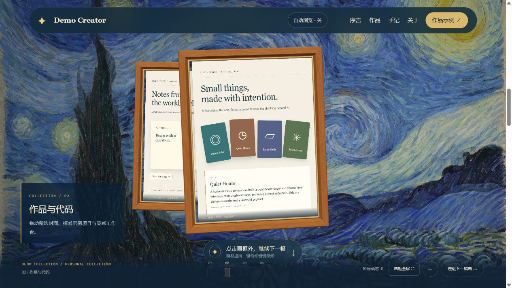

# Personal-website-ai

> In the AI era, a digital business card that belongs to you.

[→ 中文版](README.zh.md) · **Live showcase**: [personal-website-ai.chendahuang.com](https://personal-website-ai.chendahuang.com/)

---

## Project Name Candidates (not finalized)

| Candidate | Meaning |
|-----------|---------|
| **MeSite** | My site, simple and memorable |
| **AutoMePage** | Auto-generate my homepage, zero effort |
| **NexMe** | Next-gen personal digital hub, minimal and premium |
| **HostMe** | Hosting + site building all-in-one |
| **BuildMeAI** | AI builds your personal site |

## Vision

In the AI era, everyone deserves their own **digital business card** — a complete, beautiful, maintenance-free personal website, auto-built by AI.

## Template Gallery

A collection of personal homepages / digital business card templates. Each template includes a **homepage screenshot, live URL, GitHub (if any), and a reference document**.

The gallery is a **customer-acquisition / SEO asset**, not the product: it's the "menu" in M1, the delivery raw material in M2, and the traffic content in M5. New templates will be appended in the same format.

---

### 001 · Chen Dahuang · Portfolio & Content Hub


- **Homepage**：[chendahuang.com](https://chendahuang.com)
- **GitHub**：[realchendahuang/chendahuang.com](https://github.com/realchendahuang/chendahuang.com)
- **Reference**：[templates/chendahuang.com.md](templates/chendahuang.com.md)
- **Highlights**：Nuxt3 + Cloudflare, dark tech aesthetic; projects / blog / playbooks / skills / highlights; great for indie hackers and creators.

---

### 002 · CouCouYa · Community Growth & Learning in Public


- **Homepage**：[coucouya.com](https://coucouya.com)
- **GitHub**：—
- **X**：[@KeKeYa88](https://x.com/KeKeYa88)
- **Reference**：[templates/coucouya.com.md](templates/coucouya.com.md)
- **Highlights**：Dark content site; tutorials, Web3 exploration, community growth. For personal IP and content creators.

---

### 003 · Mike Lam · Entrepreneur Personal Homepage


- **Homepage**：[mc9world.com](https://mc9world.com)
- **GitHub**：—
- **X**：[@MikeLammm](https://x.com/MikeLammm)
- **Reference**：[templates/mc9world.com.md](templates/mc9world.com.md)
- **Highlights**：WordPress, bold typography hero, "let's talk" CTA. For entrepreneurs and service-oriented personal brands.

---

### 004 · Edison AI Workshop · AI Product Developer Portfolio


- **Homepage**：[edison-zwteam.pages.dev](https://edison-zwteam.pages.dev)
- **GitHub**：—
- **X**：[@Edison_aware](https://x.com/Edison_aware)
- **Reference**：[templates/edison-zwteam.pages.dev.md](templates/edison-zwteam.pages.dev.md)
- **Highlights**：Cloudflare Pages, pixel-art workshop scene; product cases + workflow capabilities. For AI product developers and automation tool builders.

---

### 005 · Su · AI Structure & Workflow Studio · Visual & Prototype Studio


- **Homepage**：[su-uni.cc](https://su-uni.cc)
- **GitHub**：[doublesq97-ui](https://github.com/doublesq97-ui)
- **Reference**：[templates/su-uni.cc.md](templates/su-uni.cc.md)
- **Highlights**：WebGL 3D hero with strong visual impact; services + works + open source + capabilities; bilingual. For designers / studios / AI workflow consultants.

---

### 006 · Kim · Kim AI Workshop · Immersive Interactive AI Studio


- **Homepage**：[kim-ai-workshop.com](https://kim-ai-workshop.com)
- **GitHub**：—
- **X**：[@king1818888](https://x.com/king1818888)
- **Reference**：[templates/kim-ai-workshop.com.md](templates/kim-ai-workshop.com.md)
- **Highlights**：Pixel-art "KIM OS" boot animation + clickable interactive scene; projects / capabilities / case files / X relationship graph / chat terminal. For AI builders and geek-style personal brands.

---

### 007 · Jack · Jack Flux · Building-in-Public Growth Log


- **Homepage**：[jack0813y.github.io](https://jack0813y.github.io)
- **GitHub**：[Jack0813y](https://github.com/Jack0813y)
- **X**：[@Jack_FluxAI](https://x.com/Jack_FluxAI)
- **Reference**：[templates/jack0813y.github.io.md](templates/jack0813y.github.io.md)
- **Highlights**：Digital-rain background + dot-matrix hero statement; numbered sections (About / Projects / Writing / Workstation / Contact); projects carry status tags (building / running / iterating) and a "current project" ticker on the home page. For engineers and developers documenting their ALL-IN-AI transition in public.

---

### 008 · Linc · LINC.WANG · Design Practice & AI Product Portfolio


- **Homepage**：[linc.wang](https://linc.wang)
- **GitHub**：—
- **X**：[@superwang](https://x.com/superwang)
- **Reference**：[templates/linc.wang.md](templates/linc.wang.md)
- **Highlights**：Editorial whitespace and clearly labeled spatial references; zaelume before/after visuals and AIRadar show product purpose, roles and usage. Interior-design and content/social services lead to a clear four-step cooperation page, with bilingual browsing and easy mobile contact. For independent designers and studio leads building digital products.

---

### 009 · MoonInAI · AI Systems Consulting & Build-in-Public Hub


- **Homepage**：[mooninai.top](https://mooninai.top/)
- **GitHub**：[chenjin-cmd](https://github.com/chenjin-cmd)
- **X**：[@MoonInAI](https://x.com/MoonInAI)
- **Reference**：[templates/mooninai.top.md](templates/mooninai.top.md)
- **Highlights**：A lunar-exploration visual system with lime accents creates a memorable identity; work, services, and a collaboration process build trust in sequence. Fits AI consultants, automation service providers, and builders working in public.

---

### 010 · Station Cat · Indie Apps & Everyday Creativity


- **Homepage**：[wwwstationcat.org](https://wwwstationcat.org/)
- **GitHub**：—
- **X**：[@statiocat](https://x.com/statiocat)
- **Reference**：[templates/wwwstationcat.org.md](templates/wwwstationcat.org.md)
- **Highlights**：Warm paper-and-noticeboard aesthetic with a grid background, serif headlines and taped cards; combines indie apps, a browser game, serial fiction and signal briefings with everyday observations; product cards show release or test status and direct links. Offers Traditional Chinese, Simplified Chinese, English and Japanese navigation options. For independent developers and multidisciplinary creators sharing their learning and building process.

---

### 011 · Jasper Wei · AI Workflow & Project Portfolio


- **Homepage**：[Jasper Wei](https://jasper-wei.vast-beech-4429.chatgpt.site/)
- **GitHub**：[Jasper-Wei1/websites](https://github.com/Jasper-Wei1/websites)
- **X**：[@Jasper_Wei1](https://x.com/Jasper_Wei1)
- **Reference**：[templates/jasper-wei.md](templates/jasper-wei.md)
- **Highlights**：React + Vite with a WebGL wave-light hero; personal introduction, project index, and case studies explaining workflows and design decisions; pause controls and reduced-motion support. For AI builders and independent creators who want to show both their work and their reasoning.

---

### 012 · Gdemoni · Personal World · Interactive Digital Garden


- **Homepage**：[zshgdemoni.me](https://zshgdemoni.me)
- **GitHub**：[gdemoni/Gdemoni-personal](https://github.com/gdemoni/Gdemoni-personal)
- **X**：[@Gdemonizsh](https://x.com/Gdemonizsh)
- **Reference**：[templates/zshgdemoni.me.md](templates/zshgdemoni.me.md)
- **Highlights**：A tear-off ticket entrance and hand-drawn digital garden connect the profile, project greenhouse, tool shed, growth path, and mailbox into one coherent world. Real project details, exploration stamps, and bilingual content make it a strong fit for student developers, AI builders, and independent developers growing their work in public.

---

### 013 · Starry Museum · Interactive Art Portfolio Template



- **Demo**: [Starry Museum](https://skyjjgw.github.io/starry-museum-portfolio/)
- **GitHub**: [Template source](https://github.com/skyjjgw/starry-museum-portfolio)
- **X**: [@skyjjgw](https://x.com/skyjjgw)
- **Reference**: [templates/starry-museum.md](templates/starry-museum.md)
- **Highlights**: Flowing Starry Night background, oak-framed live HTML exhibits, interactive project covers, page-turn notes and a tilting profile card. Optional slow autoplay, pause, reduced-motion support and mobile rendering limits. All profile/project data is fictional; this is a reusable template, not a customer case study.

---

## Milestone Roadmap

Milestones are **validation gates**, not a to-do list. Each has a gate you must pass before moving on — we validate "will anyone pay?" first, and only touch "how to scale?" last.

1. **M1 · First Paid Customer** — Hand-deliver (no AI, no pipeline) and land the first 3–5 paying customers. *Gate: ≥3 people paid real money, and you can name who, how much, and what they bought.*
2. **M2 · Repeatable Delivery** — Freeze the hand-built process into a fixed process / price / turnaround. *Gate: someone equally skilled can deliver consistent quality in a fixed time; per-customer gross margin > 0.*
3. **M3 · Automatable** — Replace the repetitive SOP steps with AI/scripts; the template gallery becomes the product's raw material here. *Gate: delivery time approaches zero, or a non-technical person can deliver using the tool.*
4. **M4 · Self-serve SaaS** — Self-service ordering, automated delivery, subscription/one-time billing. *Gate: a stranger gets a satisfying site without ever contacting you.*
5. **M5 · Scale & Profit-share** — Scaled acquisition, profit-sharing, iterate on personalization. *Gate: CAC < LTV, and at least one acquisition channel is repeatable.*

→ Detailed, checkable task breakdown: [ROADMAP.md](ROADMAP.md)

## Repo Layout

| Path | What it is |
|------|------------|
| `templates/` | Reference template docs + homepage screenshots (the gallery raw material) |
| `site/` | The showcase website — plain HTML/CSS, deployed to Cloudflare Pages |
| `MENU.md` | The M1 sales menu: 12 styles with positioning, highlights and starting prices |
| `ROADMAP.md` | Milestone gates and the M1 sales kit (listing copy, scripts, deal log) |
| `M1-DEALS.md` | Deal log — who paid, how much, what they bought (M1 gate evidence) |

## Deploying the showcase

The showcase is a static site with no build step. To publish changes:

```bash
wrangler pages deploy site --project-name personal-website-ai
```

Live at [personal-website-ai.chendahuang.com](https://personal-website-ai.chendahuang.com/)
(the `*.pages.dev` preview is `personal-website-ai-d9f.pages.dev`);
